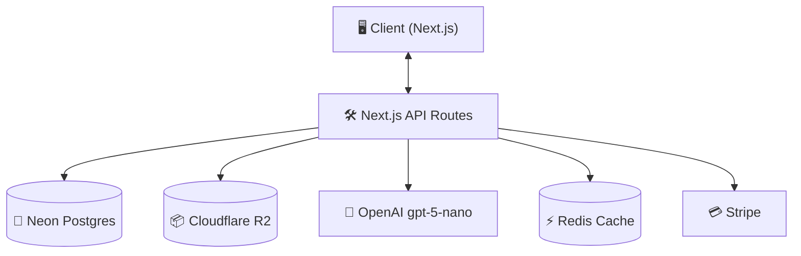
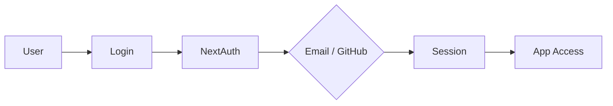
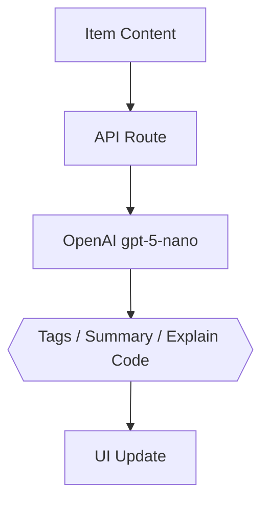

# DevStash — Project Overview

🚀 **Centralized Developer Knowledge Hub** for code snippets, AI prompts, docs, commands & more.

> **Status:** In planning · Ready for environment setup & UI scaffolding
> **Tagline:** *Store Smarter. Build Faster.*

---

## 📑 Table of Contents

1. [Problem](#-problem)
2. [Target Users](#-target-users)
3. [Core Features](#-core-features)
4. [Data Model](#️-data-model-rough-prisma-draft)
5. [Tech Stack](#-tech-stack)
6. [Monetization](#-monetization)
7. [UI / UX](#-ui--ux)
8. [Architecture Diagrams](#-architecture-diagrams)
9. [Development Workflow](#️-development-workflow-for-course)
10. [Roadmap](#-roadmap)

---

## 🎯 Problem

Developers keep their essentials scattered across too many tools:

| 📍 Where it lives today | 🧩 What gets stored                  |
| ----------------------- | ------------------------------------ |
| VS Code / Notion        | Code snippets                        |
| ChatGPT / Claude chats  | AI prompts                           |
| Random project folders  | Context files                        |
| Browser bookmarks       | Useful links                         |
| `~/Downloads` or Drive  | Docs, references                     |
| `.txt` files            | CLI commands, one-liners             |
| GitHub gists            | Project templates, boilerplates      |
| Bash history            | Terminal commands you'll never find  |

The result: **context switching, lost knowledge, and inconsistent workflows.**

➡️ **DevStash gives developers ONE searchable, AI-enhanced hub for all of it.**

---

## 🧑‍💻 Target Users

| Persona                    | Core Needs                                   |
| -------------------------- | -------------------------------------------- |
| 👨‍💻 Everyday Developer       | Quick access to snippets, commands, links    |
| 🤖 AI-First Developer       | Store prompts, workflows, contexts           |
| 🎓 Content Creator / Educator | Save course notes, reusable code examples  |
| 🧱 Full-Stack Builder       | Patterns, boilerplates, API references       |

---

## ✨ Core Features

### A) Items & System Item Types

Each item belongs to one built-in type:

| Icon | Type    | Example                            |
| ---- | ------- | ---------------------------------- |
| 🧩   | Snippet | `useDebounce` React hook           |
| 💬   | Prompt  | "Senior code reviewer" system msg  |
| 📝   | Note    | API design rationale               |
| ⌨️    | Command | `docker compose up --build -d`     |
| 📎   | File    | `.env.example`, configs            |
| 🖼️    | Image   | Architecture diagram screenshot    |
| 🔗   | URL     | Reference article, RFC link        |

> **Pro tier** can define custom types (e.g. *Recipe*, *Migration*, *Regex*).

### B) Collections

Group items together — **mixed types allowed** in a single collection.

Examples: *React Patterns*, *Context Files for Cursor*, *Python One-Liners*, *Onboarding Docs*.

### C) Search

Full-text search across:

- ✅ Content
- ✅ Tags
- ✅ Titles
- ✅ Types

### D) Authentication

- 📧 Email + password
- 🐙 GitHub OAuth

### E) Additional Features

- ⭐ Favorites & pinned items
- 🕒 Recently used
- 📥 Import from files
- 📄 Markdown editor for text items
- 🗃️ File uploads (images, docs, templates)
- 📤 Export (JSON / ZIP)
- 🌙 Dark mode (default)

### F) 🪄 AI Superpowers

| Feature              | What it does                                              |
| -------------------- | --------------------------------------------------------- |
| Auto-tagging         | Suggests relevant tags from item content                  |
| AI Summaries         | One-line summary for long notes & docs                    |
| Explain Code         | Plain-English explanation of a snippet                    |
| Prompt Optimization  | Rewrites prompts for clarity, specificity, structure      |

> 🧠 AI powered by **OpenAI `gpt-5-nano`**

---

## 🗄️ Data Model (Rough Prisma Draft)

> ⚠️ **This schema is a starting point and will evolve.** Things likely to change: indexes, cascade rules, full-text-search columns, and the `contentType` discriminator (may move to a polymorphic pattern).

```prisma
model User {
  id                   String   @id @default(cuid())
  email                String   @unique
  password             String?
  isPro                Boolean  @default(false)
  stripeCustomerId     String?
  stripeSubscriptionId String?

  items                Item[]
  itemTypes            ItemType[]
  collections          Collection[]
  tags                 Tag[]

  createdAt            DateTime @default(now())
  updatedAt            DateTime @updatedAt
}

model Item {
  id           String   @id @default(cuid())
  title        String
  contentType  String   // "text" | "file"
  content      String?  // used for text-based types
  fileUrl      String?
  fileName     String?
  fileSize     Int?
  url          String?
  description  String?
  isFavorite   Boolean  @default(false)
  isPinned     Boolean  @default(false)
  language     String?  // e.g. "ts", "py", "bash"

  userId       String
  user         User     @relation(fields: [userId], references: [id])

  typeId       String
  type         ItemType @relation(fields: [typeId], references: [id])

  collectionId String?
  collection   Collection? @relation(fields: [collectionId], references: [id])

  tags         ItemTag[]

  createdAt    DateTime @default(now())
  updatedAt    DateTime @updatedAt

  @@index([userId, updatedAt])
  @@index([userId, isFavorite])
}

model ItemType {
  id       String  @id @default(cuid())
  name     String
  icon     String?
  color    String?
  isSystem Boolean @default(false)

  userId   String?
  user     User?   @relation(fields: [userId], references: [id])

  items    Item[]
}

model Collection {
  id          String   @id @default(cuid())
  name        String
  description String?
  isFavorite  Boolean  @default(false)

  userId      String
  user        User     @relation(fields: [userId], references: [id])

  items       Item[]

  createdAt   DateTime @default(now())
  updatedAt   DateTime @updatedAt
}

model Tag {
  id     String @id @default(cuid())
  name   String
  userId String
  user   User   @relation(fields: [userId], references: [id])

  items  ItemTag[]

  @@unique([userId, name])
}

model ItemTag {
  itemId String
  tagId  String

  item   Item @relation(fields: [itemId], references: [id])
  tag    Tag  @relation(fields: [tagId], references: [id])

  @@id([itemId, tagId])
}
```

---

## 🧱 Tech Stack

| Category     | Choice                                                                                  |
| ------------ | --------------------------------------------------------------------------------------- |
| Framework    | [**Next.js**](https://nextjs.org) (React 19)                                            |
| Language     | [TypeScript](https://www.typescriptlang.org)                                            |
| Database     | [Neon PostgreSQL](https://neon.tech) + [Prisma ORM](https://www.prisma.io)              |
| Caching      | [Redis](https://redis.io) (optional)                                                    |
| File Storage | [Cloudflare R2](https://developers.cloudflare.com/r2/)                                  |
| CSS / UI     | [Tailwind CSS v4](https://tailwindcss.com) + [shadcn/ui](https://ui.shadcn.com)         |
| Auth         | [NextAuth v5](https://authjs.dev) (email + GitHub)                                      |
| AI           | [OpenAI `gpt-5-nano`](https://platform.openai.com/docs)                                 |
| Payments     | [Stripe](https://stripe.com) (subscriptions + webhooks)                                 |
| Deployment   | [Vercel](https://vercel.com) (likely)                                                   |
| Monitoring   | [Sentry](https://sentry.io) (later)                                                     |

---

## 💰 Monetization

| Plan    | Price            | Limits                  | Features                                                  |
| ------- | ---------------- | ----------------------- | --------------------------------------------------------- |
| 🆓 Free | $0               | 50 items, 3 collections | Basic search, image uploads, **no AI**                    |
| 💎 Pro  | $8/mo or $72/yr  | Unlimited               | File uploads, custom types, AI features, export, priority |

> 💳 Stripe handles subscriptions; webhooks keep `isPro` in sync.

---

## 🎨 UI / UX

- 🌙 **Dark mode first**
- ✂️ Minimal, developer-friendly UI
- 🌈 Syntax highlighting for code
- 🎯 Inspired by **Notion, Linear, Raycast**

### Layout

- 📚 **Collapsible sidebar** with filters & collections
- 🧮 Main grid/list workspace
- 🖥️ Full-screen item editor

### Responsive

- 📱 Mobile drawer for sidebar
- 👆 Touch-optimized icons and buttons

---

## 🔌 Architecture Diagrams

### System Overview



### 🔐 Auth Flow



### 🧠 AI Feature Flow



---

## 🛠️ Development Workflow (For Course)

- 🌿 **One branch per lesson** — students can follow along and compare diffs
- 🤖 Use **Cursor / Claude Code / ChatGPT** for assistance
- 🐛 Sentry for runtime monitoring & error tracking
- ⚙️ GitHub Actions (optional) for CI

**Branch naming example:**

```bash
git switch -c lesson-01-setup
```

---

## 🧭 Roadmap

### 🟢 MVP

- [ ] Items CRUD
- [ ] Collections
- [ ] Search
- [ ] Basic tags
- [ ] Free-tier limits

### 💎 Pro Phase

- [ ] AI features (tagging, summaries, explain, prompt optimization)
- [ ] Custom item types
- [ ] File uploads
- [ ] Export (JSON / ZIP)
- [ ] Billing & upgrade flow

### 🔮 Future Enhancements

- [ ] Shared collections
- [ ] Team / Org plans
- [ ] VS Code extension
- [ ] Browser extension
- [ ] Public API + CLI tool

---

🏗️ **DevStash — Store Smarter. Build Faster.**
